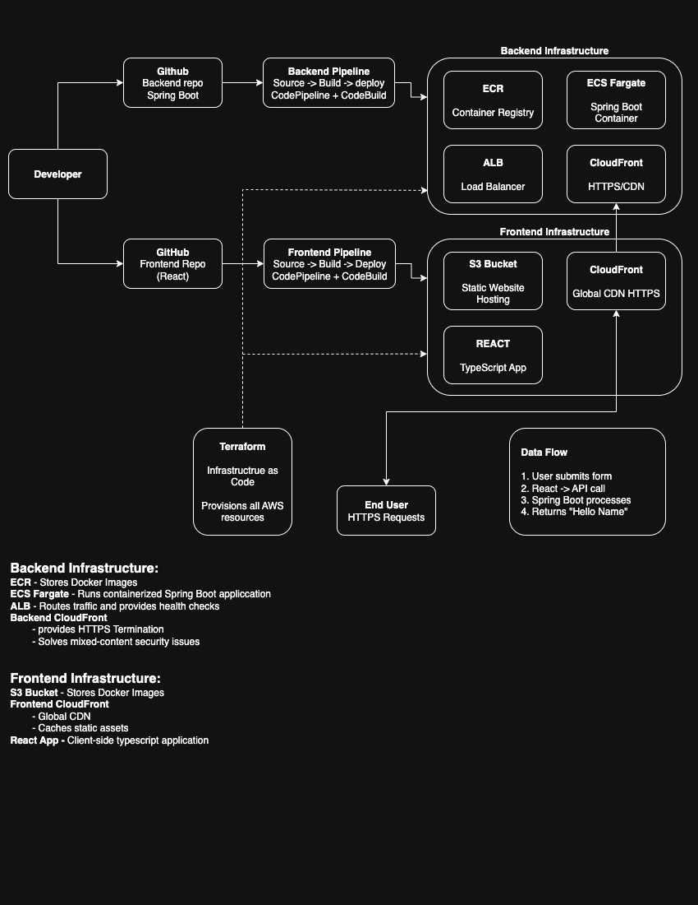

# Proof of Concept - Infrastructure

## Overview

This proof of concept demonstrates a complete full-stack application deployment pipeline using AWS services, Terraform infrastructure as code, and automated CI/CD workflows. The frontend and backend applications are intentionally kept as simple as possible while still enabling meaningful communication between the two layers.

### System Architecture
This infrastructure repository is part of a 3-repository system:

- ** [proof-of-concept-infrastructure](https://github.com/tsilvestri-slalom/proof-of-concept-infrastructure)** ← **You are here** - Terraform IaC (deploy this FIRST)
- ** [proof-of-concept-backend](https://github.com/tsilvestri-slalom/proof-of-concept-backend)** - Java Spring Boot API
- ** [proof-of-concept-frontend](https://github.com/tsilvestri-slalom/proof-of-concept-frontend)** - React application



## Infrastructure Repository Purpose

This repository contains the **foundation** of the entire proof of concept system and **must be deployed first**. It creates:

- **AWS Infrastructure**: VPC, ALB, ECS, S3, CloudFront, security groups
- **CI/CD Pipelines**: Automated deployment for both frontend and backend
- **Networking & Security**: All connectivity and access controls
- **Output Values**: Backend URLs and configuration for other repositories

## Prerequisites

Before deploying this infrastructure:

- **AWS CLI** - Configured with programmatic access
- **Terraform** - Latest version installed  
- **AWS Account** - With appropriate permissions
- **GitHub Personal Access Token** - For CI/CD integration
- **Java 17** - For local backend testing (optional)
- **Node.js v22.14.0+** - For local frontend testing (optional)

## Quick Start

### 1. Clone and Configure
```bash
git clone https://github.com/tsilvestri-slalom/proof-of-concept-infrastructure.git
cd proof-of-concept-infrastructure

# Configure AWS credentials
aws configure
```

### 2. Set Up Variables
```bash
cp terraform.tfvars.example terraform.tfvars
```

Edit `terraform.tfvars`:
```hcl
github_username = "your-github-username"
github_token = "your-github-personal-access-token"
aws_region = "us-east-1"
environment = "develop"
project_name = "proof-of-concept"
```

### 3. Deploy Infrastructure
```bash
terraform init
terraform plan
terraform apply
```

### 4. Note Important Outputs
```bash
terraform output
```

**Critical outputs for other repositories:**
- `backend_api_url` - Configure this in frontend `.env`
- `frontend_cloudfront_url` - Your deployed application URL
- `ecr_repository_url` - Docker image repository for backend

`NOTE:` You will browse to ecr_repository_url to test the app. 
`NOTE:` you will update the endpoint in the App.tsx with `backend_api_url` in `proof-of-concept-frontend` to point to the endpoint running `proof-of-concept-backend`

## Project Structure

```
proof-of-concept-infrastructure/
├── docs/
│   └── images/
│       └── architecture-diagram.png
├── cicd.tf
├── main.tf
├── variables.tf
├── terraform.tfvars.example
└── README.md
```


### CI/CD Pipeline Architecture
- **CodePipeline** orchestrates the deployment process
- **CodeBuild Projects** for building applications
- **GitHub Integration** via webhooks for automatic triggers
- **IAM Roles** with least-privilege permissions
- **Artifact Storage** in dedicated S3 buckets

## CI/CD Pipeline Behavior

### Automated Triggers
Once deployed, the infrastructure monitors:
- **Backend Repository** `develop` branch for Java Spring Boot changes
- **Frontend Repository** `develop` branch for React application changes

### Backend Deployment Flow
1. Developer merges to `develop` branch
2. GitHub webhook triggers CodePipeline
3. CodeBuild pulls source code
4. Maven builds application and creates Docker image
5. Docker image pushed to ECR
6. ECS service updated with new task definition
7. Health checks verify deployment success

### Frontend Deployment Flow
1. Developer merges to `develop` branch
2. GitHub webhook triggers CodePipeline
3. CodeBuild pulls source code
4. NPM installs dependencies and builds React app
5. Built files uploaded to S3 bucket
6. CloudFront cache invalidated
7. New version immediately available

## Managing Infrastructure

### Viewing Current State
```bash
terraform show
terraform state list
```

### Updating Infrastructure
```bash
terraform plan
terraform apply
```

### Destroying Resources
```bash
terraform destroy
```

⚠️ **Warning**: This permanently deletes all AWS resources and data.

## Monitoring and Troubleshooting

### Pipeline Monitoring
- **AWS CodePipeline Console** - Overall pipeline status
- **AWS CodeBuild Console** - Build logs and history
- **CloudWatch Logs** - Application runtime logs
- **ECS Console** - Container health and performance
- **CloudFront Console** - CDN performance and cache status

### Health Checks and Monitoring

**Application Load Balancer**:
- Health check endpoint: `/actuator/health`
- Healthy threshold: 2 consecutive checks
- Unhealthy threshold: 3 consecutive checks
- Timeout: 5 seconds, Interval: 30 seconds


## Next Steps

After successful infrastructure deployment:

1. **Verify Infrastructure**: Check all resources in AWS Console
2. **Deploy Backend**: Clone and deploy the [backend repository](https://github.com/tsilvestri-slalom/proof-of-concept-backend)
3. **Deploy Frontend**: Clone and deploy the [frontend repository](https://github.com/tsilvestri-slalom/proof-of-concept-frontend)
4. **Test CI/CD**: Make changes and merge to `develop` to verify automated deployments
5. **Monitor**: Set up CloudWatch dashboards and alerts as needed

## Configuration Reference

### Required Variables
```hcl
github_username         # Your GitHub username
github_token           # GitHub personal access token
aws_region            # AWS deployment region
environment           # Environment name (dev, staging, prod)
project_name          # Project identifier for resource naming
```
